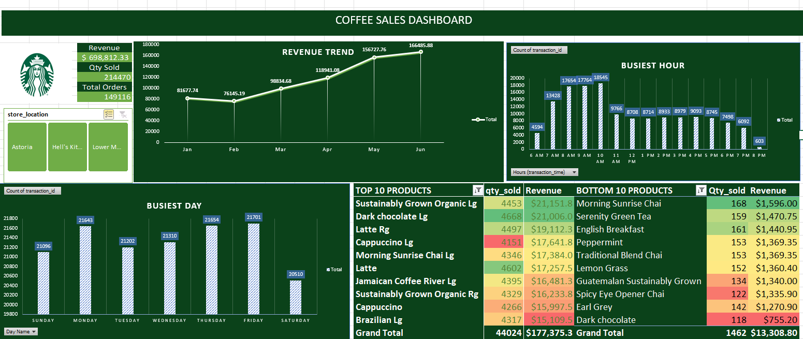

# Coffee_Sales_Dashboard

## Overview : 
This dashboard is for presenting my insights to the regional manager of the coffee chain with 3 different stores.I have created a dashboard which can help me discuss the operations of these stores with my higher-ups. This will be done solely to optimize the operations.

## Tool used :
&nbsp;

## Insights :
- Strong Revenue Momentum: Consistent revenue growth month-over-month indicates a healthy business trajectory. June shows a significant peak.

- "Sustainably Grown Organic Lg" is a Key Revenue Driver: This product commands high sales volume and revenue share.

- Peak Sales Occur Mid-Morning and Lunch: 7 AM-10 AM and around 1 PM are prime transaction times. Weekdays, especially Monday,Thursday and Friday  are the busiest 
 days.
 
- Underperforming Products Present Optimization Opportunities: "Morning Sunrise Chai" and "Serenity Green Tea" show low traction.
 
## Recommendations:

- Maximize Top Performers: Ensure consistent stock and explore targeted promotions for high-demand items like "Sustainably Grown Organic Lg."

- Optimize Menu Performance: Evaluate and potentially reposition or discontinue underperforming products to improve efficiency and focus.

- Strategic Staffing: Align staffing levels with peak hours and days to enhance customer service and capture maximum sales.

- Weekday Focus, Weekend Opportunity: Leverage strong weekday traffic with targeted offers and investigate strategies to boost weekend sales.

- Continuous Monitoring: Regularly track dashboard metrics to adapt strategies and identify new growth avenues.

## Data Story :
I have noticed that few products like 'Morning Sunrise Chai' and 'Serenity Green Tea' are underperforming. This data suggests a strategy focused on maximizing the potential of our popular items during peak hours and weekdays, while also critically evaluating and optimizing the performance of less popular offerings to enhance overall sales efficiency.
## Dashboard :
&nbsp;
